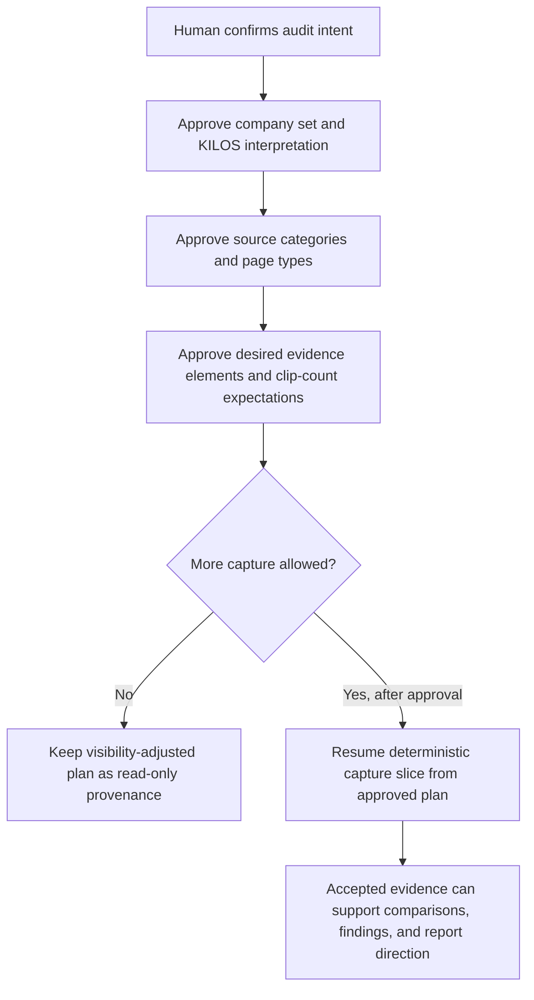

# Employer Brand Audit Human Alignment Pack V0

This pack is an alignment artifact for human review before any more Employer Brand capture work. It is not final analysis, not a report output, and not authorization to open live target URLs, run locator resolution, generate clips, or collect evidence.

## Current Assumptions

The current project compares Symphony Talent against Phenom and Radancy through the KILOS framework: Kinship, Impact, Lifestyle, Opportunity, and Status. The current evidence-control path has produced planning, review, approval, repair, visibility-adjusted capture-plan, and provenance artifacts, but accepted live captures remain at 0 and actual live clip/text assets remain at 0. The visibility-adjusted plan has 4 Operator-approved executable repairs, preserves LinkedIn as source-unavailable context, keeps 14 other non-executable context entries, leaves planned output paths null, and preserves `full_page_grab=false`.

These assumptions need human confirmation before more capture work:

- The company set is Symphony Talent as the client and Phenom plus Radancy as competitors.
- The KILOS framework is the right organizing model for this audit.
- Evidence should support comparison, finding synthesis, and report direction rather than produce final claims in this pack.
- Source-unavailable and inaccessible-source decisions should remain explicit context instead of being worked around.

## Evidence Flow

| Stage | Companies | Evidence sources | KILOS dimensions | Comparisons | Findings | Report direction |
| --- | --- | --- | --- | --- | --- | --- |
| Human alignment | Symphony Talent, Phenom, Radancy | Planned and provenance-only sources | Confirm meaning and weighting | Confirm comparison scope | Open questions only | Confirm tone and intended reader |
| Evidence requirements | Same set unless edited | Careers, employer-brand, LinkedIn context, reviews, social/campaign, awards, employee stories | Map each evidence request to one or more KILOS dimensions | Require like-for-like page/category coverage where possible | No final claims without accepted evidence | Define what the report should help the reader decide |
| Capture gate | Same set unless edited | Only approved, accessible, non-login-gated targets | Preserve KILOS metadata on each slot | Capture comparable page elements, not full pages | Mark blockers and missing evidence plainly | No report rendering in this slice |

## Evidence Requirements Brief

The next evidence slice should only proceed after the human approves the audit questions, company set, source categories, KILOS interpretation, and inaccessible-source policy. Evidence should be specific enough to support later claims: visible page text, bounded page-element clips, source URL, collection timestamp, company, source category, page type, KILOS tags, and acceptance criteria.

The current pack should help the human answer whether the audit is trying to compare positioning, proof depth, candidate experience quality, competitive differentiation, or another goal. If the goal is different, the evidence plan should change before capture resumes.

## Companies And Competitor Set

| Role | Company | Current use | Human decision needed |
| --- | --- | --- | --- |
| Client | Symphony Talent | Primary subject for comparison | Approve, rename, or replace |
| Competitor | Phenom | Peer comparison target | Approve, remove, or replace |
| Competitor | Radancy | Peer comparison target | Approve, remove, or replace |

Open question: should this audit compare only direct talent-platform competitors, or should it include aspirational employer-brand examples outside the current competitive set?

## Source Categories And Page Types

The current source model should be reviewed as categories, not as a command to collect live evidence. Candidate categories are corporate homepage, careers/employer-brand pages, product or solution pages relevant to talent acquisition, LinkedIn presence, review platforms, social or campaign pages, awards/recognition pages, employee stories, and local source artifacts used as structure references.

The human should approve which categories matter for the intended audience. If a category is inaccessible, login-gated, paywalled, blocked, or source-unavailable, the system should preserve that state as context instead of bypassing it.

## Desired Evidence Elements And Expected Clip Counts

Current source-artifact planning expects 44 local element clips across template, PDF, and SPv5 references. Current live-evidence planning has progressed to a visibility-adjusted plan with 4 executable slots and 0 accepted captures. These counts are planning state, not evidence quality.

For the next approved capture slice, each desired evidence element should identify:

- company,
- source category,
- page type,
- target element description,
- KILOS dimension tags,
- expected output count,
- text extraction requirement,
- acceptance criteria,
- blocker handling.

Human decision needed: approve whether the next live capture attempt should remain limited to the 4 visibility-adjusted executable slots, or pause until the broader source-category intent is corrected.

## What Not To Collect

Do not collect private, login-gated, paywalled, consent-bypassed, CAPTCHA-bypassed, or otherwise restricted content. Do not collect full-page grabs. Do not crawl broadly. Do not infer missing evidence. Do not treat LinkedIn unavailable context as a failure to bypass. Do not run locator codegen, locator resolution, URL opening, or live capture from this alignment pack.

## KILOS Interpretation

| Dimension | Working interpretation | Prompt for human correction |
| --- | --- | --- |
| Kinship | Belonging, culture, community, team identity, inclusion proof | What signals count as real proof rather than generic culture language? |
| Impact | Purpose, business/customer outcomes, societal value, candidate contribution | Should impact emphasize employer purpose, product value, or candidate role impact? |
| Lifestyle | Flexibility, work model, benefits, employee experience, wellbeing | Which lifestyle claims matter most to the target candidate audience? |
| Opportunity | Growth, learning, mobility, career development, hiring pathways | Should opportunity focus on employees, candidates, customers, or all three? |
| Status | Reputation, awards, market leadership, credibility, prestige | Which status signals are persuasive and which are vanity proof? |

## Source Trust And Inaccessible-Source Policy

Trust should be highest for first-party pages with visible timestamped capture evidence and lower for inaccessible, stale, or provenance-only context. Review and social sources may be useful but should be labeled by source type and collection constraints. Inaccessible sources should be recorded as unavailable, blocked, login-gated, source-unavailable, or out of scope rather than silently replaced.

Human decision needed: confirm whether inaccessible LinkedIn context should remain excluded from executable capture and represented only as source-unavailable context.

## Visual Evidence Quality Criteria

Accepted visual evidence should be page-element bounded, readable at preview width, tied to a source URL and target request, and accompanied by text when text extraction is required. Evidence should not be a full-page screenshot. Crops should include enough surrounding context to understand the claim without hiding the exact cited element. Failed locator, visibility, or content captures should remain failed until a human-approved repair changes the plan.

## Report Tone And Direction

The later report should be evidence-led, comparative, and candid about source limits. It should distinguish current assumptions from verified claims. It should avoid overstating strategic conclusions when accepted live captures are still 0. The tone should be useful to a human decision-maker who needs to approve source intent, not a polished final marketing analysis.

Open question: should the eventual report primarily recommend positioning changes for Symphony Talent, evaluate competitive parity gaps, or explain evidence quality and next collection steps?

## Explicit Human Decision Points

| Decision | Approve | Edit | Reject |
| --- | --- | --- | --- |
| Company set: Symphony Talent, Phenom, Radancy | Continue with current set | Replace or add companies | Stop comparison until set is corrected |
| KILOS framework | Use all five dimensions | Reweight or redefine dimensions | Use a different framework |
| Source categories | Use listed categories | Add, remove, or rename categories | Pause source planning |
| Live capture scope | Resume only after approval from visibility-adjusted plan | Change target intent before capture | Do not resume live capture |
| LinkedIn policy | Preserve as source-unavailable context | Provide an approved accessible substitute | Exclude LinkedIn entirely |
| Visual criteria | Require bounded element clips plus text where needed | Adjust acceptance criteria | Do not accept visual evidence |
| Report direction | Evidence-led comparative brief | Change audience or recommendation style | No report direction approved |

## Boundary For Foreman, GDI, And Operator

Foreman should treat this pack as the human alignment checkpoint before dispatching more capture work. GDI should keep this artifact read-only planning provenance and should not resume live capture in this slice. Operator needs human judgment on source intent, inaccessible-source handling, and whether the 4 visibility-adjusted slots are still the right next executable work.

## Future Direction

The Surface Annotation Intent Convergence foundation would eventually let the human approve or correct source targets directly on a live surface. That foundation is future work and is not implemented by this pack.
