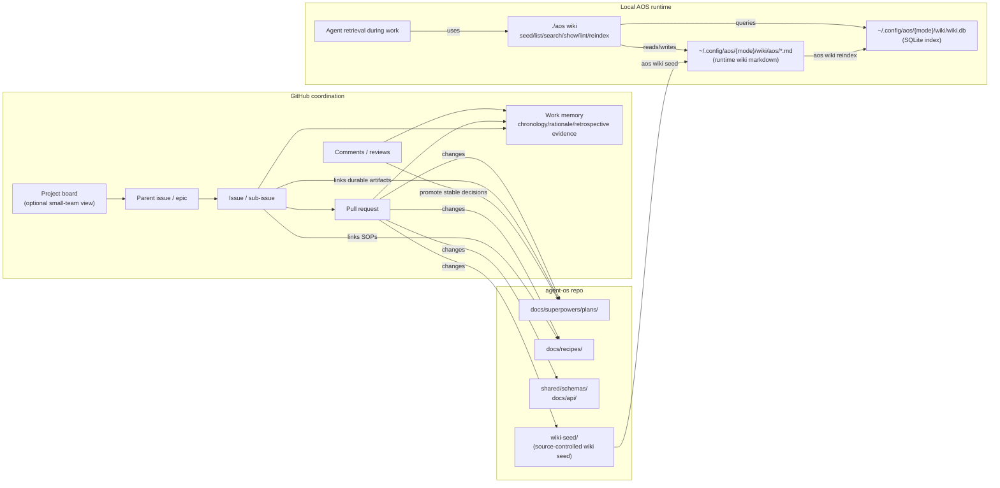
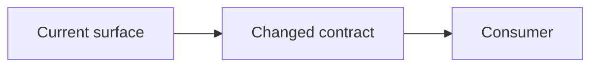
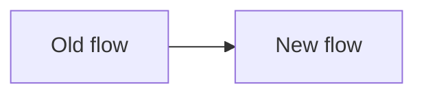

# Recipe: GitHub Coordination Hygiene

Use this recipe when deciding how to use GitHub, repo docs, wiki seed, and the
runtime AOS wiki together.

The goal is lightweight coordination for a sole human owner working with agent
teams. The system should reduce re-explaining and make future recovery easier
without creating a project-management tax.

## Small-Team Default

Use the smallest GitHub surface that keeps the work recoverable.

| Work shape | Default tracking |
|---|---|
| Same-turn fix or narrow doc change | PR only, or no issue if the change is local and obvious |
| One unresolved feature or bug | One issue linked from the PR |
| Multi-PR or multi-day feature | One parent issue with a short checklist |
| Cross-cutting work touching primitives, toolkit, apps, and docs | Parent issue plus sub-issues only where separate PRs are actually needed |
| Ongoing portfolio view | GitHub Project only if it helps the human see what is active |

Do not require an epic, project field update, issue template, diagram, or wiki
page for routine work. Add them when they prevent context loss, clarify a
boundary, or make a future agent faster.

The minimum useful loop is:

```text
issue, when needed -> plan or recipe, when durable -> PR -> close or restate issue
```

## Agent-Team Git and Worktrees

Use `docs/recipes/agent-team-git-worktrees.md` when work involves agent teams,
subagents, parallel implementation, branch handoff, pull requests, or local
worktree cleanup. Runtime agents can discover the same operating concept through
`wiki-seed/concepts/agent-team-git-worktrees.md` after `aos wiki seed`.

The short version:

- The orchestrator agent owns GitHub state, branch/worktree lifecycle,
  integration, and cleanup.
- Worker agents get bounded scopes in dedicated worktrees and return changed
  paths plus verification evidence.
- Agent-created worktrees live under `../agent-os-worktrees/` by default.
- Start and end orchestrated sessions with `scripts/agent-worktree-health`.
- Remove completed linked worktrees with `git worktree remove`, then prune stale
  metadata with `git worktree prune`.

## Durable Homes

GitHub tracks unresolved work. Repo docs and schemas define durable engineering
contracts. Wiki seed stores source-controlled agent-operable knowledge. The
runtime AOS wiki is the local retrieval copy used by agents through `aos wiki`.

GitHub is also a persistent work memory. Agents should be able to retrieve
issues, PRs, comments, reviews, and linked commits to reconstruct:

- what development tracks existed
- what was tried
- why architecture choices were made
- which alternatives were rejected
- what evidence closed the work
- how a retrospective dev story should be narrated

The distinction is source-of-truth, not usefulness:

| Surface | Best use |
|---|---|
| GitHub issues/PRs/comments | Chronology, discussion, rationale, tradeoffs, work state, review history, retrospective evidence |
| Repo docs/schemas/recipes | Current durable contracts, SOPs, API shape, verification mechanics |
| `wiki-seed/` | Source-controlled agent-operable knowledge that should be available at runtime |
| Runtime AOS wiki markdown + SQLite index | Local retrieval substrate used by agents through `aos wiki` |

| Stable result | Durable home |
|---|---|
| Scope, sequencing, implementation approach | Plan doc under `docs/superpowers/plans/` |
| Architecture or cross-tool contract | `ARCHITECTURE.md`, `docs/api/`, or `shared/schemas/` |
| Repeatable operating procedure | Recipe under `docs/recipes/` |
| Reusable agent knowledge | Wiki seed page under `wiki-seed/` |
| Active unresolved work | GitHub issue, sub-issue, or epic |
| Execution evidence | Pull request linked from the issue |

GitHub comments can be exploratory and historically valuable. Stable decisions
should still be promoted into the right durable home so future agents can
distinguish current contracts from historical discussion.

## Work Record SOP

Issues and PRs should carry enough context to be useful later as retrieval
artifacts. Keep this lightweight.

For issues:

- State the problem and desired outcome.
- Link the relevant plan, recipe, schema, or wiki seed page when one exists.
- Keep a short decision log when the thread makes or changes a decision.
- Close with the outcome, merged PR link, or exact remaining gap.

For PRs:

- Summarize what changed and why.
- Link the driving issue or plan.
- Include verification evidence.
- Call out architecture or contract implications.
- Use a Mermaid diagram when it clarifies the changed flow or relationship.

For comments and reviews:

- Use comments for discussion, tradeoffs, and review pressure.
- Promote stable decisions out of the thread into docs, schemas, recipes, or
  wiki seed.
- Link the promoted artifact back into the thread when practical.

Retrieval rule for future agents:

```text
Use GitHub to reconstruct history and rationale.
Use repo docs/schemas/wiki seed to determine current intended behavior.
Use runtime AOS wiki to retrieve local operational knowledge during execution.
```

## Mermaid Diagram SOP

Use Mermaid diagrams in issues, PRs, plans, and comments when the relationship is
materially clearer as a chart than as prose. Do not add diagrams as ceremony.

Good uses:

- An epic body that explains how work, docs, seed knowledge, and runtime state
  relate.
- A PR body that changes data flow, command flow, ownership boundaries, or
  runtime state.
- A review comment that needs to show a proposed control-flow or dependency
  correction.
- A plan that introduces multiple durable artifacts or staged PRs.

Skip diagrams for narrow bug fixes, small text edits, one-file refactors, or
anything where the chart repeats the bullets.

Preferred diagram styles:

- `flowchart` for relationships and data movement.
- `sequenceDiagram` for user/agent/runtime interactions.
- `stateDiagram-v2` for lifecycle, pause/continue, or gate behavior.
- `classDiagram` only for schema/interface shape when code references are not
  clearer.

When using the word "wiki", disambiguate the surface:

- `wiki-seed/`: source-controlled seed knowledge in the repo.
- Runtime wiki markdown: copied local pages under
  `~/.config/aos/{mode}/wiki/aos/...`.
- Runtime wiki index: local SQLite database at
  `~/.config/aos/{mode}/wiki/wiki.db`.
- `aos wiki`: CLI that seeds, indexes, lints, lists, searches, and shows local
  wiki knowledge.

## Canonical Coordination Map

Use this chart in epics, plans, or comments when the coordination model itself
is being discussed.



## Issue Body Pattern

Use this shape for work that needs an issue. Delete sections that do not help.

````markdown
## Outcome

What exists when this is done.

## Scope

In:
- ...

Out:
- ...

## Durable Artifacts

- Plan:
- Recipe:
- Schema:
- Wiki seed:

## Verification

- [ ] ...

## Coordination Map


````

## Pull Request Pattern

Use a short diagram in a PR only when it clarifies what changed.

````markdown
## Summary

- ...

## Verification

- ...

## Flow


````

## Checklist

1. Use an issue only when the work should survive beyond the current turn or PR.
2. Use a parent issue only when there are multiple PR-sized slices.
3. Use a GitHub Project only when it helps the human see the active portfolio.
4. Promote stable decisions from comments into plans, recipes, schemas, or wiki
   seed.
5. Add a Mermaid diagram only when it reduces ambiguity.
6. Disambiguate `wiki-seed/`, runtime wiki markdown, runtime SQLite index, and
   `aos wiki` whenever a discussion uses the word "wiki".
