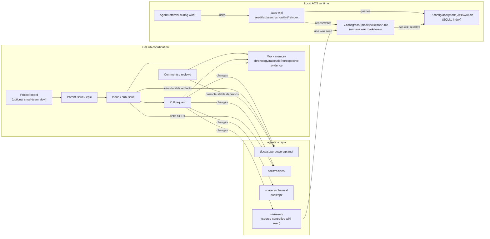

# GitHub Coordination and AOS Wiki Knowledge Layer Plan (revised)

> Status: final-pass revision. Preserves the original plan at
> `docs/superpowers/plans/2026-04-28-github-coordination-and-aos-wiki-knowledge-layer.md`
> for side-by-side comparison.
>
> Scope stance: this is a coordination and wiki-playbook substrate plan. It does
> not implement browser automation fallback behavior, source-pack trace
> projection, or steerable collection wiring. Those become follow-up plans after
> the required substrates exist.
>
> Tracking: create GitHub epic issue
> `Epic: Coordination Conventions and Web Playbooks Substrate` when this plan is
> adopted.

## Goal

Make GitHub the coordination layer for unresolved work while keeping durable
system knowledge in repo docs, schemas, recipes, and the local AOS wiki.

GitHub should answer: what is being worked on, why, with what status, with what
exit criteria, and what happened historically across a development track.

Repo docs and schemas should answer: what contracts exist, what architecture is
stable, and how repeated operations should be performed.

The local AOS wiki should answer: what operational knowledge should an agent
retrieve while doing work, especially workflows, playbooks, platform notes, and
common web UI patterns.

```text
GitHub project + issues
  -> active work, epics, sub-issues, status, priority, ownership

repo docs + schemas
  -> plans, specs, API docs, JSON schemas, recipes, implementation contracts

local AOS wiki
  -> agent-operable workflows, playbooks, concepts, entities, reusable pattern
     memory seeded from git into runtime state
```

## Ground Rules

GitHub is the persistent work record: issues, PRs, comments, reviews, linked
commits, discussion, rationale, rejected alternatives, and retrospective
evidence. Agents should be able to retrieve GitHub history to reconstruct how
the system evolved.

GitHub is not the canonical contract surface. Current architecture, API shape,
verification mechanics, and agent-operable runtime knowledge still need durable
homes in repo docs, schemas, recipes, and wiki seed.

The repo is not just a work tracker. It is the durable contract surface.

The wiki is not a replacement for repo docs. It is the retrieval surface for
agent-operable knowledge.

Important GitHub comments must be promoted into one of these durable homes when
they become decisions:

| Stable result | Durable home |
|---|---|
| Scope, sequencing, implementation approach | Plan doc under `docs/superpowers/plans/` |
| Architecture or cross-tool contract | `ARCHITECTURE.md`, `docs/api/`, or `shared/schemas/` |
| Repeatable operating procedure | Recipe under `docs/recipes/` |
| Reusable agent knowledge | Wiki seed page under `wiki-seed/` |
| Active unresolved work | GitHub issue, sub-issue, or epic |
| Execution evidence | Pull request linked from the issue |

Use GitHub to reconstruct history and rationale. Use repo docs, schemas,
recipes, and wiki seed to determine current intended behavior.

## Small-Team Default

This repo is operated by one human and one agent by default. Coordination should
reduce re-explaining, not create process drag.

Use the smallest GitHub surface that keeps the work recoverable:

| Work shape | Default tracking |
|---|---|
| Same-turn fix or narrow doc change | PR only, or no issue if the change is local and obvious |
| One unresolved feature or bug | One issue linked from the PR |
| Multi-PR or multi-day feature | One parent issue with a short checklist |
| Cross-cutting work touching primitives, toolkit, apps, and docs | Parent issue plus sub-issues only where separate PRs are actually needed |
| Ongoing portfolio view | GitHub Project only if it helps the human see what is active |

Do not require an epic, project field update, template, diagram, or wiki page for
routine work. Add them when they prevent context loss, clarify a boundary, or
make a future agent faster.

For this team, the minimum useful loop is:

```text
issue, when needed -> plan or recipe, when durable -> PR -> close or restate issue
```

## Repo Evidence That Constrains The Plan

This revision is intentionally narrower than the original plan because the
current wiki implementation has concrete limits.

- `src/commands/wiki.swift` hardcodes wiki seed directories in multiple places.
  New `wiki-seed/workflows/` and `wiki-seed/playbooks/` directories are not
  picked up unless the Swift command code changes.
- `wikiReindexCommand` currently creates and scans `plugins`, `entities`, and
  `concepts`. It indexes plugin `SKILL.md` files as `workflow`, but it does not
  scan a top-level `workflows` or `playbooks` directory.
- `wikiSeedCommand` checks for existing content and copies seed content only
  from `plugins`, `entities`, and `concepts`.
- `wikiLintCommand` checks broken links, orphans, missing names, malformed
  plugins, and index drift. It does not enforce page type schemas.
- `wikiBareNameCandidates`, `wikiAddCommand`, `searchFileContent`, and the
  command registry are also directory/type aware and must be updated together.
- `src/commands/wiki-frontmatter.swift` is a small YAML-like parser. It supports
  `key: value`, simple continuation lines, and inline arrays such as
  `[a, b, c]`. It does not support full YAML block-list semantics.
- `src/commands/wiki-index.swift` stores page `path`, `type`, `name`,
  `description`, `tags`, `plugin`, and `modified_at`. It does not index
  playbook-specific fields such as `workflows`, `platforms`, or `triggers`.
- `aos wiki invoke` resolves plugin bundles only. It does not execute arbitrary
  workflow pages.

These facts drive the staged implementation below.

## Decisions Changed From The Original Plan

| # | Original plan | Revised decision |
|---|---|---|
| 1 | Treat `workflows/` and `playbooks/` as seed conventions | Make them explicit Swift command changes in seed, reindex, lint, search, bare-name resolution, add, and command registry surfaces |
| 2 | Define an independent `automation-trace.schema.json` | Do not add a trace schema here. Source-pack timeline and trace projection belong to the steerable collection plan or a follow-up that has a real consumer |
| 3 | Wire retrieval and traces into browser automation flows | Defer. No steerable collection orchestrator exists yet, and browser automation fallback behavior is a separate implementation problem |
| 4 | Assume wiki lint can enforce page schemas immediately | Add schema and structural lint in its own PR after seed content exists |
| 5 | Use YAML examples with block lists | Use parser-compatible inline arrays in V0 examples and fixtures |
| 6 | Extend Project fields broadly | Keep Project fields few: `Status`, `Priority`, `Area`, `Epic`, `Milestone`, `Blocked reason` |
| 7 | Treat `workflow` pages as invokable | Keep `aos wiki invoke` plugin-only in V0. Workflow pages are retrievable knowledge, not executable bundles |
| 8 | Assume playbook filtering is a small `wiki list` change | Implement retrieval by reading candidate playbook files and parsing raw frontmatter. Do not change the SQLite schema in V0 |
| 9 | Bundle GitHub conventions, wiki taxonomy, seed content, schemas, retrieval, and automation wiring in one task list | Split into five independently mergeable PRs plus named follow-ups |
| 10 | Put fallback, retries, HITL gates, eval, observation, and tracing into one implementation scope | Store the first four as playbook knowledge in V0; defer executable automation behavior and tracing to follow-up plans |

## Non-Goals For V0

- No browser adapter changes.
- No Playwright action engine changes.
- No source-pack schema changes.
- No new automation trace schema.
- No desktop-wide intent sensor changes.
- No invokable workflow runner.
- No GitHub Project automation bot.
- No SQLite schema expansion for playbook metadata.
- No full YAML parser dependency.
- No Swift JSON Schema runtime dependency.

## GitHub Coordination Model

Use one GitHub Project for active operating state only if it improves visibility.
The board should show work status and development tracks. Historical context and
rationale live in issues, PRs, comments, and reviews. For routine single-issue
work, the issue and PR are enough.

Recommended fields:

| Field | Type | Values |
|---|---|---|
| `Status` | Project status | `Inbox`, `Ready`, `In progress`, `Blocked`, `Review`, `Done`, `Archived` |
| `Priority` | Single select | `P0`, `P1`, `P2`, `P3` |
| `Area` | Single select | `primitives`, `toolkit`, `apps`, `wiki`, `browser`, `docs`, `infra` |
| `Epic` | Parent issue or text | Parent issue preferred when available |
| `Milestone` | GitHub milestone | Date, release, or named phase |
| `Blocked reason` | Text | Empty unless blocked |

Labels stay low-cardinality:

```text
area:primitives
area:toolkit
area:wiki
area:browser
area:docs

type:bug
type:feature
type:spike
type:plan
type:docs

risk:privacy
risk:permissions
risk:flaky
risk:contract

workflow:employer-brand-audit
workflow:browser-automation
workflow:design-operator
```

Epics are parent issues. If GitHub issue type `Epic` is enabled, set it too, but
do not depend on issue types for portability.

Epic body template:

```markdown
## Outcome

What user-visible or agent-visible capability exists when this epic is done.

## Scope

In scope:
- ...

Out of scope:
- ...

## Durable Artifacts

- Plan:
- Spec:
- Schemas:
- Wiki pages:
- Recipes:

## Exit Criteria

- [ ] ...

## Sub-issues

- [ ] #...

## Decision Log

Stable decisions only. Link to comments for raw discussion when useful.
```

Sub-issues should be PR-sized and shallow. A useful issue contains the problem,
links to durable artifacts, acceptance criteria, verification expectations, and
the promotion target for any new durable knowledge.

Issues and PRs should be useful retrieval records for future agents:

- Issues preserve problem framing, discussion, development track, decision log,
  and closure outcome.
- PRs preserve implementation summary, verification evidence, architecture
  implications, linked issues, and review discussion.
- Comments preserve exploration and tradeoffs, but stable decisions should link
  to the promoted durable artifact when possible.
- Closed issues should say whether the work landed, moved, was rejected, or has
  a precise remaining gap.

## Mermaid Diagram SOP

Use Mermaid diagrams in issues, PRs, plans, and comments when the relationship is
materially clearer as a chart than as prose. Do not add diagrams as ceremony.

Good uses:

- An epic body that explains how GitHub, repo docs, wiki seed, and runtime wiki
  pieces relate.
- A PR body that changes data flow, command flow, ownership boundaries, or
  runtime state.
- A review comment that needs to show a proposed control-flow or dependency
  correction.
- A plan that introduces multiple durable artifacts or staged PRs.

Skip diagrams for narrow bug fixes, small text edits, one-file refactors, or
anything where the chart repeats the bullets.

Preferred diagram styles:

- `flowchart` for relationships and data movement.
- `sequenceDiagram` for user/agent/runtime interactions.
- `stateDiagram-v2` for lifecycle, pause/continue, or gate behavior.
- `classDiagram` only for schema/interface shape when code references are not
  clearer.

When using the word "wiki", disambiguate the surface:

- `wiki-seed/`: source-controlled seed knowledge in the repo.
- Runtime wiki markdown: copied local pages under
  `~/.config/aos/{mode}/wiki/aos/...`.
- Runtime wiki index: local SQLite database at
  `~/.config/aos/{mode}/wiki/wiki.db`.
- `aos wiki`: CLI that seeds, indexes, lints, lists, searches, and shows local
  wiki knowledge.

Canonical coordination map:



## Wiki Taxonomy

V0 recognizes these top-level wiki seed directories:

```text
wiki-seed/plugins/
wiki-seed/entities/
wiki-seed/concepts/
wiki-seed/workflows/
wiki-seed/playbooks/
```

Runtime seed target:

```text
~/.config/aos/{mode}/wiki/aos/plugins/
~/.config/aos/{mode}/wiki/aos/entities/
~/.config/aos/{mode}/wiki/aos/concepts/
~/.config/aos/{mode}/wiki/aos/workflows/
~/.config/aos/{mode}/wiki/aos/playbooks/
```

V0 page type convention:

| Directory | Default type | Purpose |
|---|---|---|
| `plugins/` | `workflow` for `SKILL.md` | Bundled invokable wiki plugins |
| `entities/` | `entity` | Named systems, apps, services, repos, people, organizations |
| `concepts/` | `concept` | Reusable architecture or domain concepts |
| `workflows/` | `workflow` | Agent-operable procedures such as employer brand audit |
| `playbooks/` | `playbook` | Reusable tactical guidance for sites, patterns, failures, and gates |

V0 intentionally does not add `site-note` or `pattern` as top-level enforced
types. Those can be represented as playbooks with `scope`, `platforms`, and
`tags` until there is enough usage to justify more page classes.

## Playbook Frontmatter Contract

Use parser-compatible inline arrays. Do not use YAML block lists in V0 wiki
playbook seed files.

Example:

```markdown
---
type: playbook
name: Retry and Fallback
id: web-ui.common.retry-and-fallback
status: draft
version: 0.1.0
workflows: [employer-brand-audit]
platforms: [generic-web]
triggers: [playwright-action-failed, locator-stale, safety-gate-timeout]
capabilities: [fallback, retry, hitl-gate]
tags: [web-ui, collection, reliability]
---

# Retry and Fallback

...
```

Required V0 fields for `type: playbook`:

| Field | Meaning |
|---|---|
| `type` | Must be `playbook` |
| `name` | Human-readable title |
| `id` | Stable namespaced id such as `web-ui.common.retry-and-fallback` |
| `status` | `draft`, `validated`, or `deprecated` |
| `version` | Semver-like page contract version |
| `workflows` | Inline array of workflows this playbook can support |
| `triggers` | Inline array of retrieval triggers |

Recommended optional fields:

| Field | Meaning |
|---|---|
| `platforms` | Inline array such as `[generic-web]`, `[linkedin]`, `[greenhouse]` |
| `capabilities` | Inline array such as `[fallback, retry, observation]` |
| `tags` | Existing wiki tag field |
| `requires` | Existing wiki dependency field |
| `owner` | Human or team owner when known |
| `last_validated` | Date when behavior was last checked |

## Staged Implementation

### PR 1 - GitHub Coordination Hygiene

Purpose: document how GitHub entities, repo docs, and the local wiki divide
responsibility.

Files:

- Maintain `docs/recipes/github-coordination-hygiene.md`.
- Optionally add `.github/ISSUE_TEMPLATE/epic.md` and
  `.github/ISSUE_TEMPLATE/work-slice.md` if the repo wants template support.

Tasks:

- Define when to create an issue, epic, PR, recipe, plan, schema, or wiki page.
- Define the small-team default so lightweight work does not need epics,
  projects, or sub-issues.
- Define the Mermaid diagram SOP and include the canonical coordination map.
- Define what belongs in GitHub comments versus durable repo/wiki artifacts.
- Define how to close or restate stale issues when work has landed.
- Include a short example mapping for `Employer brand audit`.

Acceptance:

- A future agent can decide where to put a new idea without reading this plan.
- The recipe includes the Mermaid map that disambiguates GitHub coordination,
  repo wiki seed, runtime wiki markdown, and the runtime SQLite index.
- The recipe matches root `AGENTS.md` guidance on GitHub issues and durable
  knowledge placement.
- No runtime or wiki command behavior changes.

Verification:

```bash
rg -n "GitHub|wiki|recipe|issue" docs/recipes/github-coordination-hygiene.md
```

### PR 2 - Wiki Page-Class Plumbing

Purpose: make `workflows/` and `playbooks/` real wiki seed and index classes.

Files:

- Modify `src/commands/wiki.swift`.
- Modify `src/shared/command-registry-data.swift`.
- Update `wiki-seed/README.md`.
- Add focused wiki command tests under `tests/`.

Tasks:

- Add one shared directory/type mapping in `wiki.swift` instead of repeating
  literal lists.
- Extend seed content detection to include `workflows` and `playbooks`.
- Extend seed copying to include `workflows` and `playbooks`.
- Extend reindex directory creation to include `workflows` and `playbooks`.
- Extend reindex markdown scanning to index:
  - `entities` as default `entity`.
  - `concepts` as default `concept`.
  - `workflows` as default `workflow`.
  - `playbooks` as default `playbook`.
- Keep plugin `SKILL.md` indexing behavior unchanged.
- Extend index-drift lint to include `workflows` and `playbooks`.
- Extend file-content search to include `workflows` and `playbooks`.
- Extend bare-name resolution to include `workflows/<name>.md` and
  `playbooks/<name>.md`.
- Extend `wiki add` to accept `workflow` and `playbook`.
- Update command registry usage, flags, and examples for `wiki add`,
  `wiki list`, `wiki search`, and `wiki show` if examples mention known types.

Acceptance:

- `aos wiki seed --force --from wiki-seed` copies workflow and playbook seed
  files into the `aos/` namespace.
- `aos wiki reindex --json` indexes workflow and playbook pages.
- `aos wiki list --type workflow --json` returns seeded workflow pages.
- `aos wiki list --type playbook --json` returns seeded playbook pages.
- `aos wiki add playbook retry-and-fallback --json` writes under
  `aos/playbooks/`.

Verification:

Swift command changes require rebuilding the local binary before direct `./aos`
verification.

```bash
bash build.sh
./aos wiki seed --force --from wiki-seed --json
./aos wiki reindex --json
./aos wiki list --type workflow --json
./aos wiki list --type playbook --json
./aos wiki lint --json
```

### PR 3 - First Seeded Workflow And Playbooks

Purpose: seed enough real knowledge to support the first end-to-end workflow:
Employer brand audit leading into the Design/Publications room.

Files:

- Create `wiki-seed/concepts/web-automation-playbook-registry.md`.
- Create `wiki-seed/workflows/employer-brand-audit.md`.
- Create `wiki-seed/playbooks/web-ui/common/hitl-gates.md`.
- Create `wiki-seed/playbooks/web-ui/common/retry-and-fallback.md`.
- Create `wiki-seed/playbooks/web-ui/common/eval-and-observation.md`.
- Create `wiki-seed/playbooks/platforms/linkedin-company-page.md`.
- Create `wiki-seed/playbooks/platforms/greenhouse-careers.md`.
- Update `wiki-seed/README.md`.

Content requirements:

- `employer-brand-audit.md` explains the workflow phases:
  collection, evidence marking, analysis, synthesis, and final Design Room
  artifact forging.
- `hitl-gates.md` documents pause, continue, step, abort, timeout, and human
  clarification gates as playbook knowledge only.
- `retry-and-fallback.md` documents retry budgets, cutoff thresholds, fallback
  categories, and when to ask the human instead of continuing.
- `eval-and-observation.md` documents observation, evaluator notes, and evidence
  quality checks without defining a trace schema.
- Platform playbooks capture durable site patterns for oft-visited websites and
  web apps.
- All playbook frontmatter uses inline arrays.

Acceptance:

- Seeded pages are useful to a human reader before any retrieval code exists.
- Pages link to each other using wiki-relative markdown links.
- Pages do not claim executable automation behavior has shipped.

Verification:

```bash
rg -n "type: workflow|type: playbook|workflows: \\[|triggers: \\[" wiki-seed
./aos wiki seed --force --from wiki-seed --json
./aos wiki reindex --json
./aos wiki list --type playbook --json
./aos wiki lint --json
```

### PR 4 - Playbook Schema And Lint

Purpose: make playbook pages contract-backed without adding a Swift JSON Schema
runtime.

Files:

- Create `shared/schemas/wiki-playbook.schema.json`.
- Create `docs/api/wiki-playbooks.md`.
- Modify `src/commands/wiki.swift`.
- Add tests for valid and invalid playbook fixtures.

Tasks:

- Define the schema for `type: playbook` frontmatter.
- Document that V0 arrays are inline arrays because the current parser is not a
  general YAML parser.
- Add manual structural validation inside `aos wiki lint` for indexed pages
  with `type == "playbook"`.
- Validate required fields: `id`, `type`, `name`, `status`, `version`,
  `workflows`, and `triggers`.
- Validate `status` enum: `draft`, `validated`, `deprecated`.
- Validate array-like fields by reusing the existing inline-array parser.
- Report block-list-looking values as lint errors with a fix hint to use inline
  arrays.
- Add JSON Schema fixture validation in tests if the repo already has a
  lightweight JS schema test path; otherwise keep the JSON schema as
  documentation and rely on Swift lint for runtime enforcement.

Acceptance:

- `aos wiki lint` fails on missing required playbook fields.
- `aos wiki lint` fails on block-list playbook arrays.
- `aos wiki lint` passes the seeded playbook set.
- The schema doc and Swift lint agree on required fields.

Verification:

```bash
bash build.sh
./aos wiki lint --json
rg -n "wiki-playbook" shared/schemas docs/api tests
```

### PR 5 - Playbook Retrieval CLI

Purpose: let agents retrieve playbooks by workflow, platform, trigger, and
capability without changing the wiki index schema.

Files:

- Modify `src/commands/wiki.swift`.
- Modify `src/shared/command-registry-data.swift`.
- Add focused retrieval tests.

Command shape:

```bash
aos wiki list --type playbook \
  --workflow employer-brand-audit \
  --platform linkedin \
  --trigger locator-stale \
  --capability retry \
  --json
```

Implementation:

- Require `--type playbook` when playbook-specific filters are present.
- Use the existing index to get candidate playbook page paths.
- Read candidate files from disk.
- Parse raw frontmatter keys with existing inline-array parsing.
- Apply filters with AND semantics.
- Treat `platforms: [generic-web]` as a generic match when a specific platform
  filter is present, but rank specific platform matches higher.
- Return path, name, id, status, workflows, platforms, triggers, capabilities,
  tags, and a short description.
- Do not add `workflows`, `platforms`, or `triggers` columns to SQLite in V0.

Acceptance:

- Agents can ask for playbooks tied to `employer-brand-audit`.
- Agents can retrieve common web UI playbooks and platform-specific playbooks.
- Command registry help exposes the new filters.
- The implementation does not change `aos wiki invoke`.

Verification:

```bash
bash build.sh
./aos wiki list --type playbook --workflow employer-brand-audit --json
./aos wiki list --type playbook --platform linkedin --json
./aos wiki list --type playbook --trigger safety-gate-timeout --json
./aos wiki list --type playbook --capability observation --json
```

## Mapping To Requested Future Topics

| Topic | V0 treatment in this plan | Follow-up treatment |
|---|---|---|
| Fallback when Playwright cannot do the job | Seeded playbook content | Automation fallback engine plan |
| Retry logic with cutoff thresholds | Seeded playbook content | Browser collection execution policy |
| Timeouts or hard pause for HITL gates | Seeded playbook content | Run-control and steerable collection implementation |
| Playbook storage for common web UI patterns, websites, and platforms | `wiki-seed/playbooks/` plus retrieval CLI | Promotion workflow after repeated use |
| Tie playbooks to workflows | `workflows: [...]` frontmatter and retrieval filters | Source-pack or collection session references after source-pack exists |
| Eval and observation | Seeded playbook content and retrieval filters | Collection timeline/evaluator event design |
| Tracing | Explicitly deferred | Source-pack trace projection plan with a concrete consumer |

## Follow-Up Plans

### Playbook Retrieval In Collection

Create after steerable collection has a real orchestrator.

Inputs:

- This plan through PR 5.
- Human intent sensing and steerable collection source-pack contract.
- Browser adapter execution model.

Outputs:

- Where collection sessions call playbook retrieval.
- How selected playbooks are recorded in session artifacts.
- How stale or conflicting playbooks are surfaced to the human.

### Automation Fallback, Retry, Timeout, And HITL Policy

Create when implementing executable browser behavior.

Outputs:

- Retry budgets by action type.
- Cutoff thresholds.
- HITL timeout and hard-pause semantics.
- Fallback ladder when Playwright cannot complete the action.
- Evaluation hooks and observation events.

### Trace Projection

Create only after there is a consumer for trace playback or audit views.

Outputs:

- A projection from canonical collection/source-pack events into a playback or
  debug trace view.
- No parallel event log unless the consumer requires one and the source-pack
  timeline cannot satisfy it.

### Playbook Promotion Hygiene

Create after at least several playbooks are used in real sessions.

Outputs:

- When a runtime-discovered pattern becomes a wiki seed page.
- How confidence moves from `draft` to `validated`.
- How deprecated site patterns are retired.

## Pre-Flight

- Work on `main` unless the user explicitly asks for branch-based work.
- Do not touch unrelated dirty Sigil files.
- For PRs that change Swift wiki commands, run `bash build.sh` before direct
  `./aos` verification.
- `./aos ready` is not required for docs/wiki command work because these tasks
  do not need daemon readiness, display surfaces, or input taps.
- Prefer temp isolated state in tests. Direct manual verification may mutate the
  current repo-mode wiki under `~/.config/aos/repo/wiki`.

## Overall Acceptance Gates

The plan is implemented when:

- The GitHub coordination recipe exists and agrees with root `AGENTS.md`.
- `wiki-seed/workflows/` and `wiki-seed/playbooks/` are copied, indexed,
  searched, linted, and listable.
- The first Employer brand audit workflow and supporting web UI playbooks are
  seeded.
- Playbook frontmatter has a documented schema and lint enforcement.
- Agents can retrieve playbooks by workflow, platform, trigger, and capability.
- No browser automation, source-pack, or trace behavior is claimed as shipped by
  this plan.

## Residual Risks

- Playbook content may be too theoretical until used in real collection
  sessions. Mitigation: keep initial pages `status: draft`.
- Inline-array frontmatter is less ergonomic than YAML block lists. Mitigation:
  accept the current parser in V0 and revisit only if authoring pain becomes
  real.
- Querying by reading candidate files is less efficient than indexing metadata.
  Mitigation: defer index expansion until the wiki has enough playbooks for
  performance to matter.
- GitHub Project fields can become process drag. Mitigation: keep fields few
  and put durable detail in repo/wiki artifacts.
- Automation reliability concerns are adjacent but not solved here. Mitigation:
  seed them as playbook knowledge now and implement behavior only in the
  follow-up automation policy plan.
