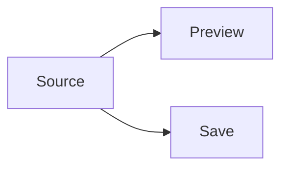

# Markdown Workbench

Edit the source on the left and inspect the rendered preview beside it.

## First Slice

- file-backed launch
- source and preview panes
- explicit save handoff
- outline and diagnostics

